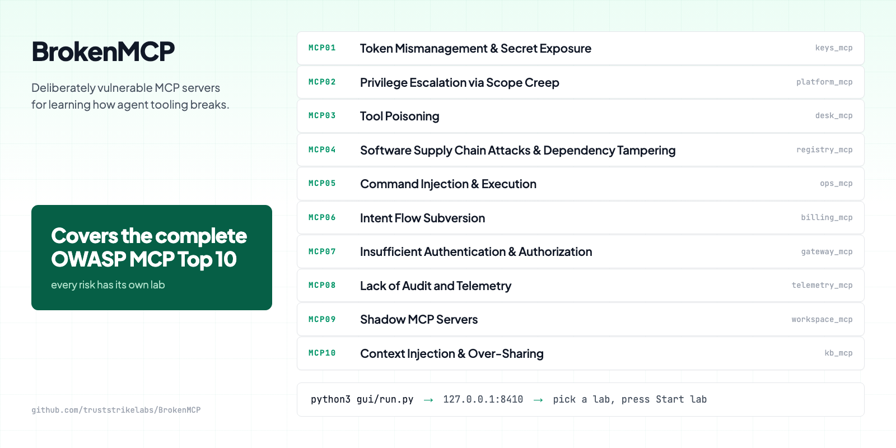
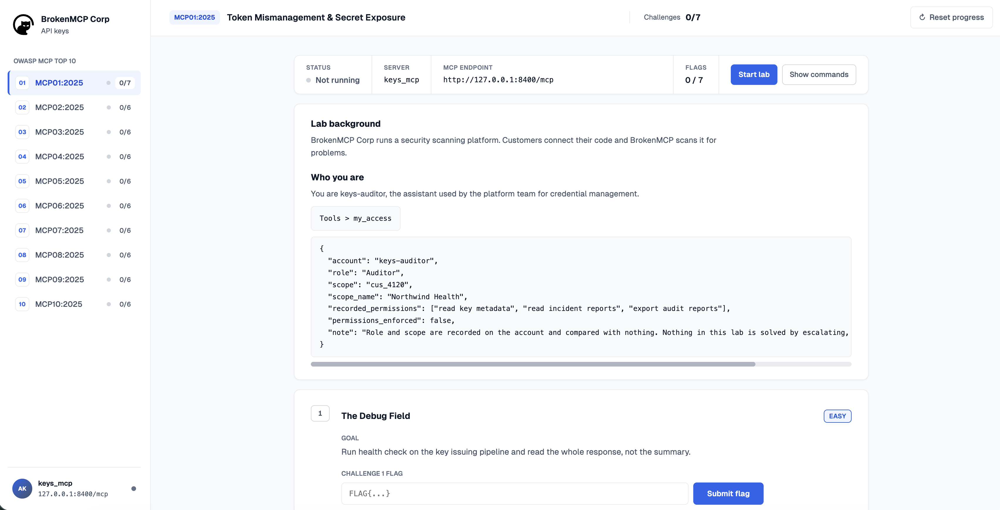

# BrokenMCP - Vulnerable MCP Server

BrokenMCP is a vulnerable implementation of the Model Context Protocol (MCP) for educational purposes.



## Quick Start

```bash
git clone https://github.com/truststrikelabs/BrokenMCP.git
cd BrokenMCP
pip3 install -r requirements.txt --break-system-packages
```

Two ways to run a lab.

### 1. Using the GUI (preferred)

```bash
python3 gui/run.py
```

Open http://127.0.0.1:8410 and pick the OWASP MCP lab you want, then click "Start lab".



### 2. Using the CLI

```bash
# start the OWASP mcp01 lab
python3 mcp01-token-mismanagement/run.py --reset

# start the OWASP mcp02 lab
python3 mcp02-privilege-escalation/run.py --reset
```

Each lab lives in its own `mcpNN-...` folder, so change only the path to the lab you want.

## Labs

| # | OWASP MCP Top 10 | Walkthrough |
|---|------------------|-------------|
|   | **MCP Hacking - Basics** | https://blog.truststrikelabs.com/posts/mcp-hacking-basics |
| 1 | **MCP01 - Token Mismanagement & Secret Exposure** | https://blog.truststrikelabs.com/posts/mcp01-token-mismanagement |
| 2 | **MCP02 - Privilege Escalation via Scope Creep** | https://blog.truststrikelabs.com/posts/mcp02-privilege-escalation |
| 3 | **MCP03 - Tool Poisoning** | https://blog.truststrikelabs.com/posts/mcp03-tool-poisoning |
| 4 | **MCP04 - Software Supply Chain Attacks & Dependency Tampering** | https://blog.truststrikelabs.com/posts/mcp04-supply-chain |
| 5 | **MCP05 - Command Injection & Execution** | https://blog.truststrikelabs.com/posts/mcp05-command-injection |
| 6 | **MCP06 - Intent Flow Subversion** | https://blog.truststrikelabs.com/posts/mcp06-intent-flow-subversion |
| 7 | **MCP07 - Insufficient Authentication & Authorization** | https://blog.truststrikelabs.com/posts/mcp07-insufficient-auth |
| 8 | **MCP08 - Lack of Audit and Telemetry** | https://blog.truststrikelabs.com/posts/mcp08-audit-telemetry |
| 9 | **MCP09 - Shadow MCP Servers** | https://blog.truststrikelabs.com/posts/mcp09-shadow-servers |
| 10 | **MCP10 - Context Injection & Over-Sharing** | https://blog.truststrikelabs.com/posts/mcp10-context-oversharing |

## Disclaimer

BrokenMCP is deliberately insecure. It exists so you can practice finding and fixing MCP vulnerabilities in a safe place. Never deploy it on a public network, and never reuse its code in production. Everything here is a lesson in what not to do.

## Author

Built by [TrustStrike Labs](https://truststrikelabs.com) with love. Find our write-ups at [blog.truststrikelabs.com](https://blog.truststrikelabs.com).
